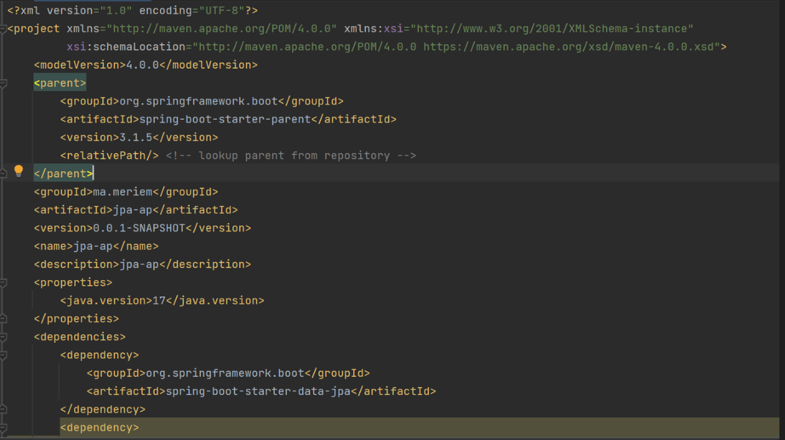
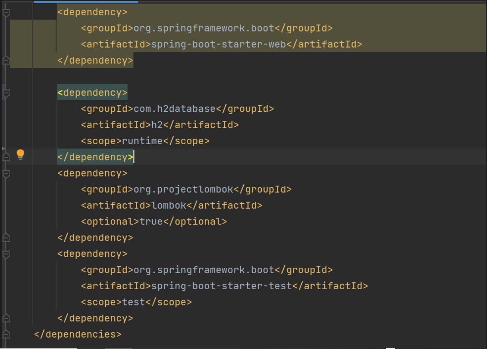
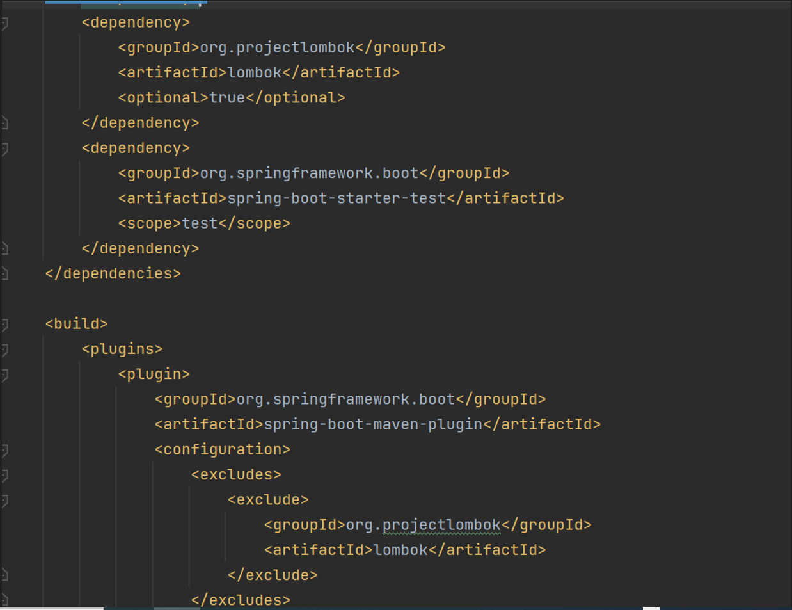
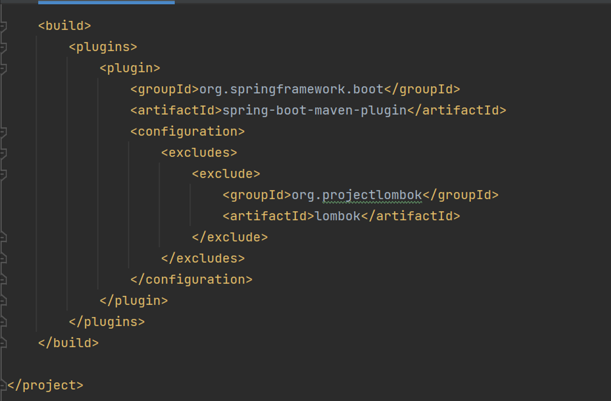

<h2>Introduction</h2>

Le TP N°2 se concentre sur la mise en œuvre d'une application Java Spring qui utilise la technologie JPA (Java Persistence API) en conjonction avec Hibernate, Spring Data, et une base de données H2. ORM (Object-Relational Mapping) est une technique clé au cœur de cette tâche, permettant de relier les entités Java aux tables de la base de données. Spring Data facilite l'accès aux données en fournissant des méthodes de requête automatisées pour les opérations CRUD (Create, Read, Update, Delete).
   
  L'objectif principal de ce TP est de créer une application de gestion des patients en utilisant Spring Boot. Les étapes clés comprennent la définition d'entités JPA pour représenter les données des patients, la configuration d'une unité de persistance, la création d'un repository Spring Data pour accéder aux données de manière efficace, et la réalisation de diverses opérations de gestion des patients, notamment l'ajout, la consultation, la recherche, la mise à jour et la suppression.
   
  En outre, ce TP explore le concept de migration de H2 Database vers MySQL. H2 est une base de données en mémoire légère, tandis que MySQL est un système de gestion de base de données relationnelle robuste. Cette migration permet d'illustrer comment passer d'une base de données de développement à une base de données de production, tout en maintenant la cohérence des données.

<h2>Énoncé</h2>
<ol>
  <li>Installer IntelliJ Ultimate</li>
  <li>Créer un projet Spring Initializer avec les dépendances JPA,H2,Spring Web et Lombock</li>
  <li>Créer l'entité JPA Patient ayant les attributs :</li>
  <ul>
    <li>id de type Long</li>
    <li>nom de type String</li>
    <li>date de naissance de type Date</li>
    <li>malade de type booléen</li>
    <li>score de type int</li>
  </ul>
  <li>Configurer l'unité de persistance dans le fichier application.properties</li>
  <li>Créer l'interface JPA Repository basée sur Spring Data</li>
  <li>Tester quelques opérations de gestion</li>
  <ul>
    <li>Ajouter des patients</li>
    <li>Consulter tous les patients</li>
    <li>Consulter un patient</li>
    <li>Chercher des patients</li>
    <li>Mettre à jour un patient</li>
    <li>supprimer un patient</li>
  </ul>
  <li>Migrer de h2 Database vers MySQL</li>
</ol>
<h2>Étapes du TP</h2>
<ol>
  <li>Installation d'IntelliJ Ultimate</li>
  
La première étape du TP consiste à installer IntelliJ IDEA Ultimate, un environnement de développement intégré (IDE) puissant, qui sera utilisé pour le développement de l'application.

  <li>Création d'un Projet Spring Initializer</li>
  
J'ai crée un projet Spring Boot à l'aide de Spring Initializer.
    J'ai ajouté les dépendances suivantes :
  

  <ul>
    <li>JPA</li>
    <li>H2 (base de données en mémoire)</li>
    <li>Spring Web (pour les contrôleurs web)</li>
    <li>Lombok (pour la génération automatique de code)</li>
  </ul>

Lorsque je  consulte le fichier pom.xml, je trouve que les dépendances
  ont été bien ajouté<

  
 
 
 

Ensuite, on crée l'entité JPA Patient avec les attributs demandés

  <li>Création de l'Entité JPA Patient</li>

J'introduis une entité JPA nommée "Patient" avec les attributs suivants :
id (de type Long), nom (de type String), 
dateNaissance (de type Date), malade (de type booléen) et score (de type int).

p>Ensuite, on crée l'entité JPA Patient avec les attributs demandés

  <li>Configuration de l'Unité de Persistance</li>

J'effectue la configuration de l'unité de persistance dans le fichier
application.properties, où je définis les paramètres de connexion à la
base de données H2, notamment le chemin JDBC,
le nom d'utilisateur et le mot de passe.

p>Ensuite, on crée l'entité JPA Patient avec les attributs demandés

  <li>Création de l'Interface JPA Repository</li>

J'élabore une interface JPA Repository en 
utilisant Spring Data. Cette interface permettra d'effectuer des opérations de base de données sans nécessiter
l'écriture de requêtes SQL manuellement.

  <li>Tests des Opérations de Gestion</li>

 <li>Migration de H2 Database vers MySQL</li>

</ol>

